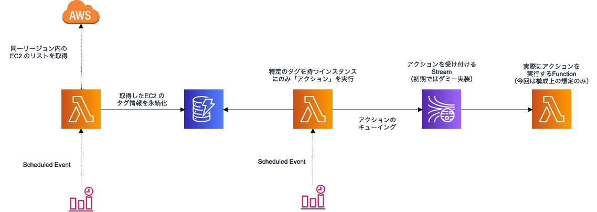

# README

Serverless Framework を題材にした、テストコードの課題アプリです。

## 要件

- ローンチしているEC2インスタンスのうち、特定のインスタンスにだけ、定期的に何らかの「アクション」を実行したい
- 定期実行だけでなく、任意のタイミングでユーザーから（API経由で）実行を指示できる方法も提供する計画が決まっている
  - 次のステップとして、任意のインスタンスに対して、任意のタイミング（API経由）でアクションを実行できるようにする方針

### タグに関連する補足情報

- タグを用いて「アクション」が必要なインスタンスを管理する
  - Key == require_action && Value == true のタグを持つインスタンスを「アクション」の対象とする
- 「アクションの要否/種類」はEC2のタグで管理する
  - 「アクションが必要なもの」だけをフィルタして1台ずつ _some\_action_ を実行する

## 問題の注意点

アクションの詳細は今回のお題の関心から逸れるので具体的なロジックには踏み込まず、 _put\_action\_record_ というフェイク実装で代用しています。構成図右半分の Kinesis, lambda は実際には存在せず、「ストリームに投げる」という想定のダミー実装 (_put\_action\_record_) の提供のみに留めています

EC2 のタグ情報収集ロジックは、実際には削除されたインスタンスの扱いなどを考慮していないので不完全なものですが、課題を解く上では無視してください。なお、EC2 のタグ情報収集ロジックは、今回はフェイク実装で代用しており実際に EC2 API はコールしません。

## 発展課題

- 複数アクションへの対応
  - 'required_action' の代わりに、 'actions' というタグを使う
  - 'actions' タグの Value にはカンマ区切りで複数のアクション名を記述する仕様とする
  - 実行可能なアクションの種類は 'backup_action', 'audit_action' の2種類とする（アクションの定義はソースコード中で定義して良い）
  - カンマ区切りの前後にスペースが含まれる場合はスペースもアクション名の一部として扱う
  - Fail Case
    - 定義していないアクション以外が1つでも含まれていた場合
    - Value が未定義の場合は何もせず正常終了
